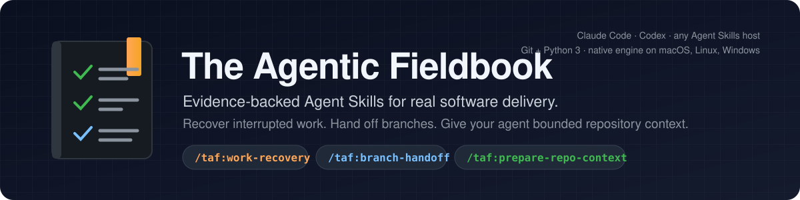
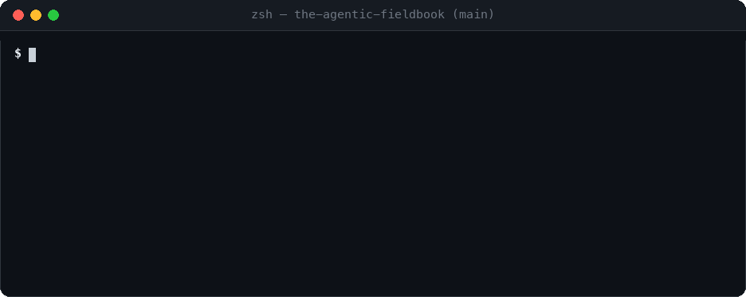
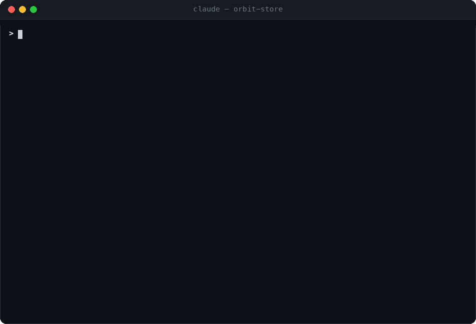
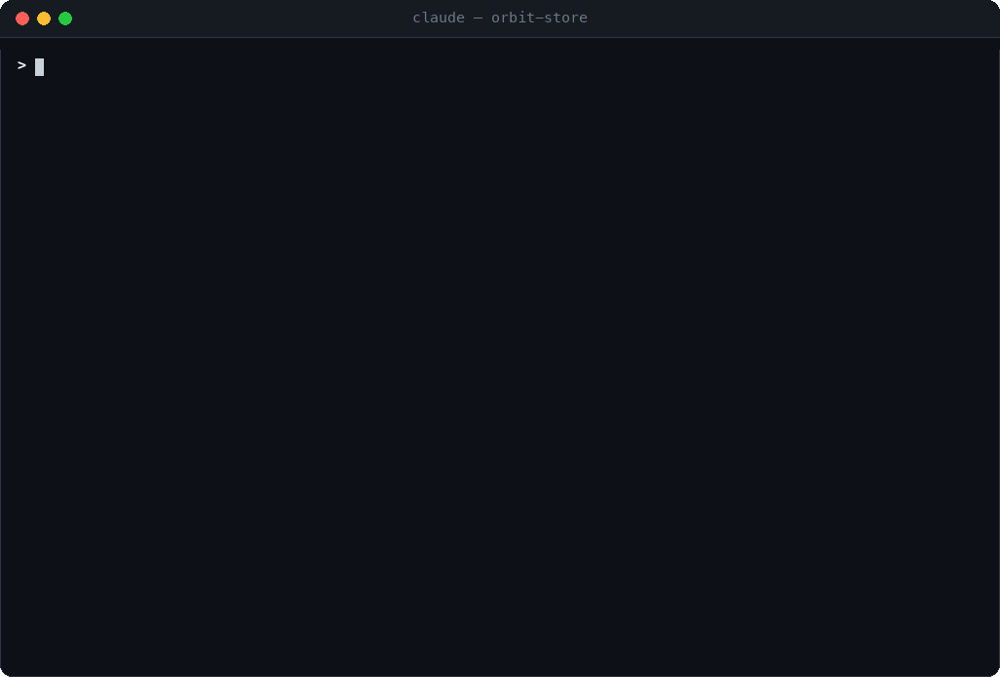
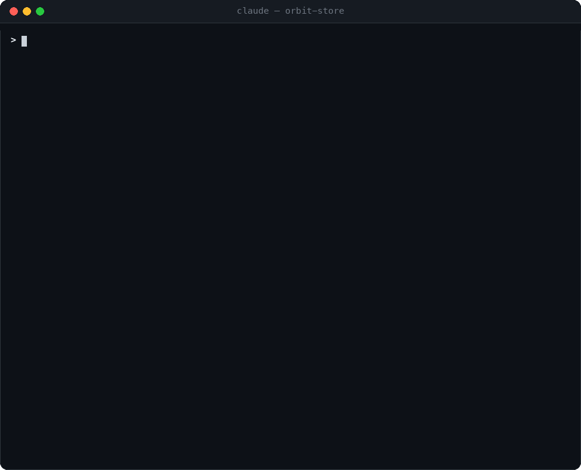
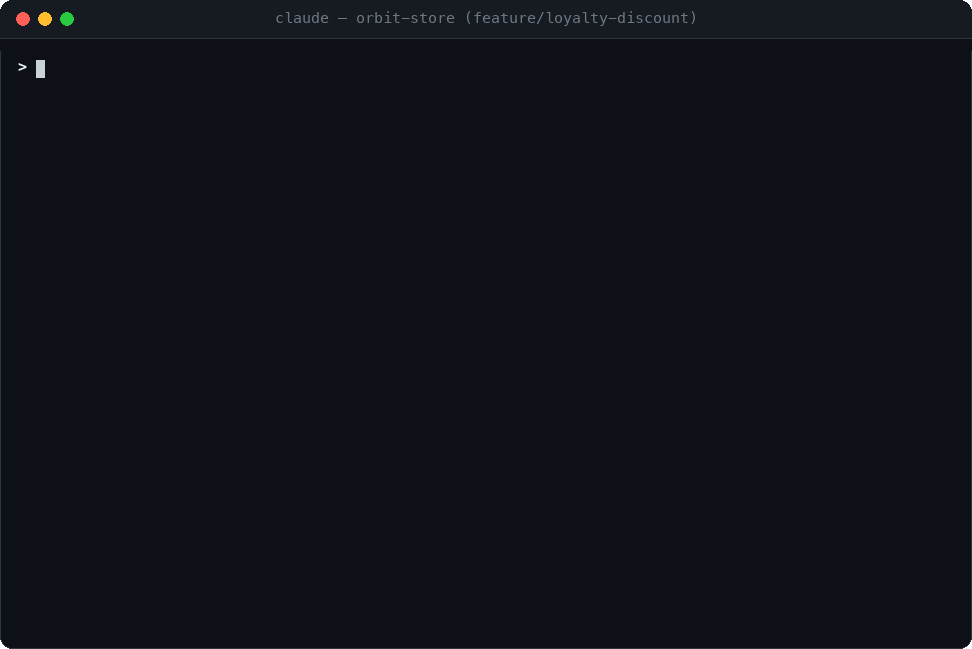
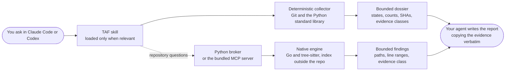

<div align="center">



# The Agentic Fieldbook

**Evidence-backed Agent Skills for real software delivery.**<br>
Recover interrupted work. Hand off branches. Give your agent bounded repository context.

[](https://github.com/Phalegethon/the-agentic-fieldbook/releases/latest)
[](LICENSE)
[](https://agentskills.io/specification)
[](#install-taf)
[](#install-taf)
[](docs/prepare-repo-context.md#runtime-requirements)
[](https://github.com/Phalegethon/the-agentic-fieldbook/actions/workflows/release-native-context.yml)

</div>

**The Agentic Fieldbook (TAF)** is one plugin containing focused Agent Skills
for the parts of software delivery that agents usually get wrong: knowing where
work stopped, handing a branch to review and QA with evidence instead of
guesses, and understanding a codebase without stuffing it into the context
window. Install TAF once; use its skills independently in Claude Code, Codex,
or any host that follows the open
[Agent Skills specification](https://agentskills.io/specification).

<p align="center">
  
</p>
<p align="center"><sub>The commit-time impact warning: one bounded query against the local index, printed to stderr, never blocking the commit.</sub></p>

## Why TAF

<table>
<tr>
<td width="50%" valign="top">

**Evidence, not vibes**<br>
Every finding carries a path, a line range, and an evidence class. Agent prose
copies exact states, counts, and SHAs from deterministic scripts; a preview is a
hint, never proof, and nothing is invented to fill a gap.

</td>
<td width="50%" valign="top">

**Bounded by design**<br>
Results fit a character budget you choose. The index lives outside your
repository, a query returns only the records that answer it, and the full
codebase is never loaded into model context.

</td>
</tr>
<tr>
<td width="50%" valign="top">

**Read-only until you say otherwise**<br>
The first pass of every skill only reads. Writing index state, downloading the
engine, installing a hook, or touching Jira and GitHub each needs its own
explicit consent in the conversation.

</td>
<td width="50%" valign="top">

**One plugin, every host**<br>
Claude Code and Codex install the same plugin; other hosts use the `skills`
CLI. Runtime needs are Git and Python 3 with no package dependencies. The
native engine ships as a checksum-verified binary for macOS, Linux, and
Windows and understands Python, TypeScript, JavaScript, Go, Rust, and
Markdown.

</td>
</tr>
</table>

## Skills at a glance

| Skill | Ask it when | You get |
|---|---|---|
| [`work-recovery`](skills/work-recovery) 1.1.0 | You return to a branch and cannot remember where you stopped. | The exact work state, what is staged and unstaged, and the single best next step, from read-only Git evidence. |
| [`branch-handoff`](skills/branch-handoff) 1.2.1 | A branch is ready for review or QA. | Copy-ready QA and Developer/PR handoffs with priorities and confidence levels, plus an evidence appendix, with optional Jira and GitHub context. |
| [`prepare-repo-context`](skills/prepare-repo-context) 1.9.0 | Your agent needs to understand or navigate a codebase. | Repository overview, symbol search, who-calls-what, change impact, a commit-time warning about dependents you left behind, and an MCP server that exposes it all. |

Claude Code exposes these as `/taf:branch-handoff`, `/taf:prepare-repo-context`,
and `/taf:work-recovery`. Codex uses the corresponding plugin-qualified TAF
skills and can select them automatically for relevant requests. Names such as
`pr-summary`, `release-risk`, `incident-brief`, and `dependency-audit` are
roadmap items, not shipped skills.

## Install TAF

### Claude Code

Add the TAF marketplace, install the single plugin, and reload:

```text
/plugin marketplace add Phalegethon/the-agentic-fieldbook
/plugin install taf@the-agentic-fieldbook
/reload-plugins
```

Open the plugin details to see all contained skills. Installing TAF makes the
collection discoverable; Claude reads a full `SKILL.md` only when that skill
is invoked or selected.

### Codex

Add this Git repository as a marketplace and install the single TAF plugin:

```bash
codex plugin marketplace add Phalegethon/the-agentic-fieldbook
codex plugin add taf@the-agentic-fieldbook
```

The Codex app then presents `taf:branch-handoff`, `taf:prepare-repo-context`,
and `taf:work-recovery` beneath TAF. The repository contains a native
`.codex-plugin/plugin.json`; no copied aggregate skill bundle is created.

### Other Agent Skills hosts

For a host supported by the `skills` CLI, install the complete TAF collection
for that agent:

```bash
npx --yes skills@latest add Phalegethon/the-agentic-fieldbook \
  --skill '*' \
  --agent antigravity \
  --yes
```

Replace `antigravity` with the intended supported agent. Add `--global` only
for an intentional user-wide installation. This compatibility path may
materialize separate skill directories because the host has no plugin
container, but it installs the same TAF collection from the same canonical
`skills/` sources.

## Migrate to TAF 2.0

<details>
<summary>Coming from the 1.x per-skill plugins? Run this clean migration once.</summary>

TAF 2.0 replaced the former `branch-handoff` and `work-recovery` Claude
plugins with one `taf` plugin. Run this in order:

```text
/plugin uninstall branch-handoff@the-agentic-fieldbook
/plugin uninstall work-recovery@the-agentic-fieldbook
/plugin marketplace update the-agentic-fieldbook
/plugin install taf@the-agentic-fieldbook
/reload-plugins
```

The old namespaces are intentionally not retained. After reloading, verify that
`/taf:branch-handoff`, `/taf:prepare-repo-context`, and `/taf:work-recovery`
appear under the TAF plugin. Historical Git tags remain available if an
installation must be recovered, but TAF 2.x is the supported product line.

</details>

## Update TAF

Claude Code users refresh the marketplace and update the unified plugin:

```text
/plugin marketplace update the-agentic-fieldbook
/plugin update taf@the-agentic-fieldbook
/reload-plugins
```

To opt into Claude marketplace auto-update, open `/plugin`, choose
`Marketplaces`, select `the-agentic-fieldbook`, and enable auto-update. TAF
never enables silent updates or performs a network update check while a skill
runs.

Codex users refresh the Git marketplace and reinstall the selected product:

```bash
codex plugin marketplace upgrade the-agentic-fieldbook
codex plugin add taf@the-agentic-fieldbook
```

Agent Skills compatibility installations rerun the matching `skills@latest add`
command with the same agent and scope, then verify active paths with
`npx --yes skills@latest list --json`.

Subscribe to this repository's GitHub Releases for TAF product updates. Every
product release lists the bundled skill versions, and a release note says
whether the native engine changed, so you know when a new download is coming.

## Use work-recovery

<p align="center">
  
</p>

From the interrupted Git worktree, ask:

```text
Use /taf:work-recovery to tell me where this work stopped and the single best next step. Do not run tests or change repository state.
```

The report copies the dossier's exact work state (`active-dirty` above) and the
evidence class of every claim, summarizes staged and unstaged work separately,
and ends with a reminder rather than a generated handoff. To move the same
evidence into another session, ask separately:

```text
Now turn that recovery dossier into a compact continuation prompt for another session.
```

<details>
<summary>Default boundaries</summary>

- Reads bounded current-worktree Git metadata and tracked staged/unstaged diff
  evidence; other worktrees contribute metadata only.
- Untracked content requires exact path authorization and remains protected by
  no-follow, file-type, size, binary, generated, and credential gates.
- Does not run tests, builds, lint, project validation, or repository mutation.
- Does not build or update an index, query a provider, or access the network.
- On an explicit request for indexed context, adds at most a readiness check
  and one read-only `prepare-repo-context` change-impact query against an
  index that is already ready, and reports the symbols the work touched with
  their one-hop dependents. It never builds, installs, or downloads an index,
  and it never delays or replaces the native report.
- Writes no recovery artifact and reports exact evidence omissions within the
  selected context budget.

</details>

Runtime requirements are Git and Python 3. The bundled collector uses only the
Python standard library. Full behaviour: [docs/work-recovery.md](docs/work-recovery.md).

## Use branch-handoff

<p align="center">
  
</p>

From a Git repository, ask:

```text
Use /taf:branch-handoff to compare this branch with main and prepare the DEV and QA handoff.
```

Natural-language invocation also works when the host supports automatic skill
selection. When the request supplies neither a platform target nor `local
only`, the skill asks one combined structured question for optional Jira and
GitHub context before any diff analysis, then requests only the selected
targets and permissions. To include Jira intent and acceptance criteria,
supply the exact issue:

```text
Use branch-handoff to compare the current branch with origin/main and prepare the DEV and QA handoff. jira FE-2669
```

<details>
<summary>Default boundaries</summary>

- Uses a merge-base comparison and prefers a fresh remote base when available.
- Reads committed changes only unless working-tree inclusion is requested.
- Does not run project tests, builds, lint, code review, blame, or broad history.
- Produces local QA, Developer/PR, and evidence sections.
- Keeps Jira and GitHub local by default. Every platform read or comment needs
  the session-scoped consent described by the skill.

</details>

Runtime requirements are Git and Python 3. There are no Python package
dependencies. Full behaviour: [docs/branch-handoff.md](docs/branch-handoff.md).

## Use prepare-repo-context

<p align="center">
  
</p>

From a Git repository, ask:

```text
Use /taf:prepare-repo-context to inspect this repository and prepare reusable bounded context.
```

The first pass is read-only: it reports native engine availability, freshness,
eligible and excluded path counts, user-local state usage, and the next safe
action. It does not load the full repository into model context. If no
reusable index is ready, the skill asks before any persistent or network
action; with approval it downloads the matching native runtime from the TAF
GitHub release, verifies the published SHA-256 checksum, and builds the index
outside the repository. Later sessions reuse the bound index, and after edits
the next query refreshes it incrementally.

Once ready, ask repository questions in plain language:

| Question | What answers it |
|---|---|
| "How is this repository organized?" | `repository-overview`: a directory table with file, definition, document, and configuration counts, plus a ranked file layer that leads with entry points. |
| "Who calls `apply_discount`?" | `search-symbols` finds the anchor, then `related-symbols` follows `callers`, `callees`, `importers`, or `imports`; every edge carries its evidence. |
| "What did I change, and what could it affect?" | `changed-symbols` and `impact-candidates` compare the working tree with the branch's base; each candidate is attributed to the changed symbols it depends on. |
| "What is my staged change about to affect?" | The same two operations with `--staged`, measured exactly as `git commit` would record it. |

<p align="center">
  
</p>

### Commit-time impact warning

Ask to be warned when you leave dependents behind, approve the hook write, and
every `git commit` gets the advisory report shown at the top of this page: a
header, at most five aligned detail lines, and a trailer naming what was left
out. It writes to stderr only, always exits 0, waits at most 3 seconds, and
stays silent whenever the index is not ready or nothing was left behind.

```bash
<python> skills/prepare-repo-context/scripts/prepare_repo_context.py hook status --repo <repo>
<python> skills/prepare-repo-context/scripts/prepare_repo_context.py hook install --repo <repo> --confirm-hook-write
```

Everything about chaining an existing hook, `TAF_HOOK=0`, and how the launcher
follows plugin updates: [docs/commit-time-impact-hook.md](docs/commit-time-impact-hook.md).

### The repo-context MCP server

TAF bundles an MCP stdio server that exposes the same operations as tools:
`inspect`, `build`, `repository_map`, `search_symbols`, `search_docs`,
`source_snippets`, `related_symbols`, `changed_symbols`, `impact_candidates`,
and `repository_overview`. Claude Code and Codex start it from the plugin; one
engine process serves the whole session. `build` is the only tool that writes
state and is marked so the host asks first. Details and manual registration:
[docs/repo-context-mcp-server.md](docs/repo-context-mcp-server.md).

Runtime requirements are Git and Python 3; Go is not required. Full behaviour,
filters, budgets, and state reclamation:
[docs/prepare-repo-context.md](docs/prepare-repo-context.md).

## How it works



Each skill keeps repeatable work in a script and loads its full instructions
only when it runs. The scripts decide what evidence exists; the agent decides
how to say it, under a contract that forbids renaming a state or inventing a
number.

## Versioning and releases

TAF and its skills have separate versions:

- TAF `2.9.0` versions the collection, manifests, namespaces, and release.
- `branch-handoff` `1.2.1` versions its behavior contract.
- `prepare-repo-context` `1.9.0` versions its behavior contract.
- `work-recovery` `1.1.0` versions its behavior contract.

New primary GitHub releases use the TAF product version, beginning with
`v2.0.0`. Historical per-skill releases remain as legacy records. The
[CHANGELOG](CHANGELOG.md) records every release with its bundled skill
versions and whether the native runtime changed.

## Repository structure

<details>
<summary>Where things live</summary>

```text
the-agentic-fieldbook/
├── .agents/plugins/marketplace.json
├── .claude-plugin/            marketplace.json, mcp.json, plugin.json
├── .codex-plugin/             mcp.json, plugin.json
├── docs/                      guides and the README media
├── skills/
│   ├── branch-handoff/        SKILL.md, agents/, references/, scripts/collect_diff.py
│   ├── prepare-repo-context/  SKILL.md, agents/, references/, scripts/prepare_repo_context.py
│   └── work-recovery/         SKILL.md, agents/, references/, scripts/
├── tools/
│   ├── taf-context/           Python broker and the repo-context MCP server
│   └── taf-context-native/    Go engine (built and published by the release workflow)
└── tests/
```

Both plugin manifests use the same canonical `skills/` directory. Full skill
instructions are not combined into one prompt.

</details>

## Verification

```bash
python3 -m unittest discover -s tests -p 'test_*.py' -v
scripts/vendor-work-recovery-runtime --check
claude plugin validate .
```

Codex packaging can be tested without changing a normal Codex installation by
using a temporary `CODEX_HOME`, adding the repository marketplace, and
installing `taf@the-agentic-fieldbook`.

## Contributing

Issues, skill proposals, forks, and pull requests are welcome. Contributors use
their own GitHub identities; `@Phalegethon` is the maintainer and review owner,
not a required commit identity. See [`CONTRIBUTING.md`](CONTRIBUTING.md).

Created and maintained by
[Gürkan Süerdem (@Phalegethon)](https://github.com/Phalegethon).

## License

MIT. See [`LICENSE`](LICENSE).
